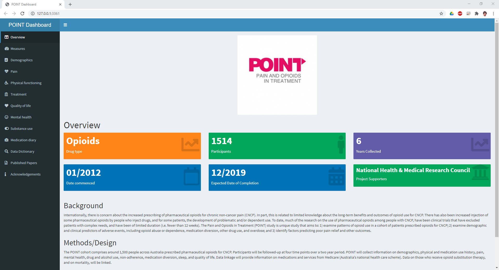

# ndarc-point-dashboard
A shiny app dashboard that shows a novel way of presenting longitudinal data. 

## Introduction
This shiny app dashboard demonstrates a novel way to present your data to the world. This dashboard is based on a six year prospective study of those using pharmaceutical opioids to treat chronic non-cancer pain. 

## Sections
The POINT project had distinct questions relating to various components of the participant's life. These were sectioned into separate tabs for exploration. 

### 1. Overview & Meta data (drafted)
The Overview tab, gives an introduction to the paper and provides the metadata for familiarisation. 

### 2. Measures (drafted)
The POINT study utilised various questionnaires relating to the different aspects of the participant's life. These measures are detailed here with relevant sources and clinical cut offs.

The measures section was created and saved as a comma separareted value (.csv) and is read into the tab using the 'DT' library.

### 3. Demographics (completed)
The demographics tab shows baseline demographic information about the participants. It is divided into 4 boxes.

### 4. Pain (completed)
The pain section summarises the chronic pain conditions that participants self reported as well as the brief pain inventory (BPI) severity and interference scores. 

### 5. Physical Function (completed)
Has exercise, pseq and sleep scores. 

### 6. Treatment (to do)
This section contains the other treatments for chronic pain, perceived effect of treatment, beliefs about medicines, convenience accessing medications, side-effects of opioid medicatio, barriers to treatment, reasons for discontinuing, aberrant opioid medication-related behaviours (ROBIT) and opioid difficulties (PODS).

I have currently completed the ORBIT section. 

### 7. Quality of Life (completed)
This section was based on two questions asked about quality of life and health satisfaction. Numbers were summarised into proportions over time. 

### 8. Mental Health(to do)

### 9. Substance Use (completed)
This section collected information about participants lifetime and current drug use as well as their classification of abuse or dependence based on certain criteria. This section was built with three rows to separate each subsection of the Substance Use tab. 

Many of the plots now are similar to each other with only the input variable changing, speeding up the time it takes to make the section.

### 10. Medication Diary (completed)
At each wave, a seven-day medication diary collected frequency and dose information on all consumed pain-related medicines, psychiatric medicines and prescribed sleep medicines. The measures, tools, and data domains were selected based on recommendations made by the Initiative on Methods, Measurement, and Pain Assessment in Clinical Trials (IMMPACT).

The medication diary has five boxes which are divided into three sections. The first row is a selector, to select a medication which is sourced from the data dictionary. The results are filtered only to show 'medication diary' and 'drug'. 

The second row shows the proportion of users using a line plot with confidence intervals with the third box showing a table of summaries which comprise the plot. 

The third row shows a line plot of mean OME across time with the fifth box showing the summary table for the corresponding plot. 

### 11. Data Dictionary (completed)
Data dictionaries are essential for data management. Many of them can be found in word documents, excel sheets or are a part of software attributes for example in SPSS. Here, the data dictionary (saved as a csv) is called into the shiny app using the 'DT' library. Here, not only is the data dictionary loaded and available, the app can handle the 4000 + variables in this dataset. Furthermore, there is a search bar on the top right that searches for text within the dictionary across all columns. To supplement this feature, categories and subcategories were added in separate columns to aid those who are unfamiliar with the data to find relevant variables and their descriptions.

When you look up a search term:

### 12. Published Papers
This section showcases the published papers relating to the POINT dataset.

### 13. Acknowledgements

## Conclusion